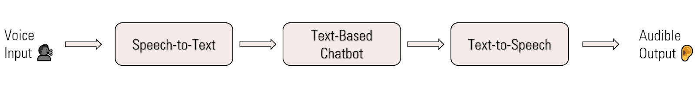
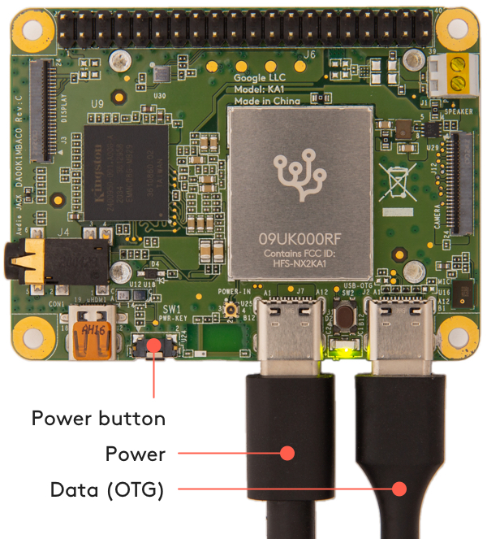
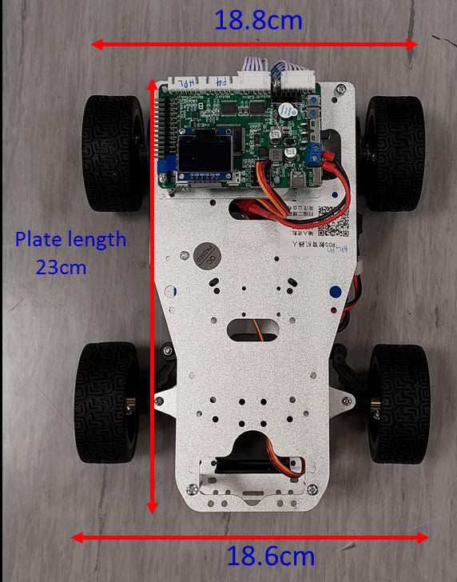

# Raymond Lim

Computer Engineering (B.Eng.), Nanyang Technological University — Singapore

Interested in AI applications, cloud compute and computer hardware/architecture & low level systems.

## Skills

- **Languages:** C / C++, Python, Java, JavaScript / HTML / CSS
- **Areas:** AI/ML integration, Embedded Systems, REST APIs, Computer Architecture

### Notable Coursework:
- ##### SC4079 FINAL YEAR THESIS - SYSTEM DESIGN FOR EMBEDDED CONVERSATIONAL AI BOARDS
- ##### SC4052 CLOUD COMPUTING
- ##### SC3103 EMBEDDED PROGRAMMING
- ##### SC3050 ADVANCED COMPUTER ARCHITECTURE

## Projects

### Final Year Project — System Design for Embedded Conversational AI Boards
*NTU, AY2024/25 · Grade: B+*

- Designed and evaluated an embedded system for running a real-time speech-to-speech AI chatbot (speech-to-text → chatbot → text-to-speech) on the resource-constrained Google Coral Mini board.
- Diagnosed that the board's 1GB LPDDR4 RAM could not run three neural networks concurrently, then pivoted to a Hybrid Edge-Cloud architecture: a Python/Flask API on Google Cloud Functions offloaded STT, GPT-4, and Google TTS while the Coral Mini served as an edge I/O device.
- Applied model quantization and compression (TensorFlow Lite, YamNet) and benchmarked latency, cost, and privacy trade-offs (~200ms–1.2s response times; ~$5–10/month projected cloud cost).
- Delivered a reusable design template and cost-benefit analysis for future embedded AI deployments.

  
  

### NTU Multi-Disciplinary Project (MDP) — Autonomous Exploration Robot

Project Goal: Build a robotic system that autonomously explores/traverses a known area, detecting images displayed on the arena. The robot should perform obstacle avoidance using visual markers “bulls eye”. Transmit and receive control signals from mobile device. Simulate physical robot and algorithms in software
Result: *NTU · Grade: A- · Top 8 of 54 teams in CS cohort)*

- Built the robot's low-level control on the PID/hardware team, programming an STM32F407VET6 microcontroller to drive motor drivers and read gyroscope sensors for an autonomous arena-exploration robot (image recognition and obstacle avoidance).
- Implemented PID motion control for straight-line travel and PID-controlled turning with gyroscope feedback for accurate, repeatable navigation within a maze.
- Handled UART communication between the STM32 and the rest of the system.

  
  

### Xiangji AI (2024)
*Video-translation & generative-AI pipeline*

- Integrated external APIs in Python and built an AI text-scrubber within a video-translation pipeline.
- A/B tested Stable Diffusion workflows (img2img, ControlNet, OpenPose) to set default client prompt configurations.
- Tested REST endpoints via Postman and authored Mandarin technical API documentation — see the public docs at [xiangji-ai/xiangji-api](https://github.com/xiangji-ai/xiangji-api).

### SC1015 — Data Science & AI Project
*NTU · Group project*

- Processed and cleaned movie data from Kaggle and compared models for predicting IMDb scores.
- Models used: numeric linear regression, multivariate linear regression, and random forest regression.
- Key finding: Rotten Tomatoes score was the strongest predictor of IMDb score; multivariate linear regression outperformed the more resource-intensive random forest.

  
  
  

### ThriftIt — SC2006 Software Engineering
*NTU · Group project*

- Built an online platform for Singapore thrift shops to list and sell products to buyers.
- Key features: buyer and business profiles, product listings, and search / sort / filter across accounts.
- Integrated the OneMap API to display shop locations and provide navigation.

  
  
  

